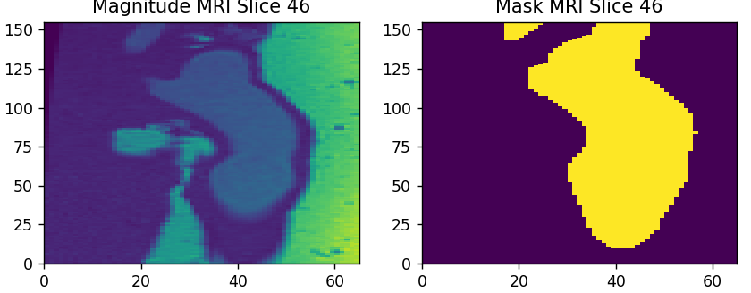
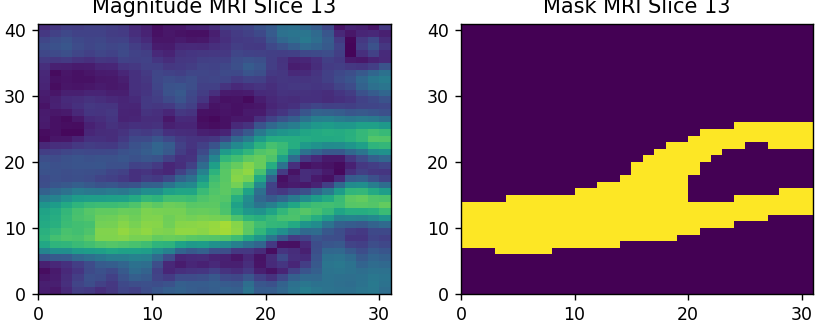

# Segmenting MRI Density/Magnitude Scans with a Fully Convolutional Network (FCN) ResNet

This sub-project explores segmenting MRI scans with the built in FCN_ResNet_101 in PyTorch.
The application of this particular segmentation is to use the segmentation as a high
quality first estimate for blood vessel boundaries, which will then be refined using
an iterative solver. The refined boundaries will then be used as a prior for the Inverse
Navier-Stokes Problem. See https://mpj1001.user.srcf.net/MJ_Flow_MRI.html for more details
on the full project.

To dive deeper into this sub-project, we use a combined Weighted Cross-Entropy and Focal-Tversky Loss
to train the FCN. These choices of loss functions allow us to preferentially target accurate
positive (foreground) prediction, since the training data tends to sparse (majority background).

One of the largest difficulties of this project is the lack of quality pre-segmented data.
To overcome this, we use two base scans (pre-segmented using traditional techniques).
One of the Carotid, and one of the Aorta. These are then warped using varying sine fields,
producing high-quality artificial data to train the model on. Some demonstrative slices are
shown below.

Note the data is not yet publicly available.