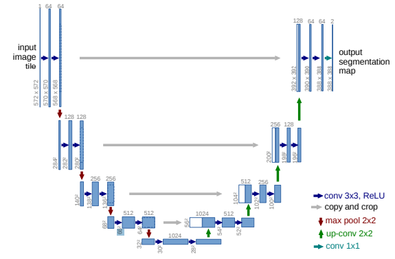
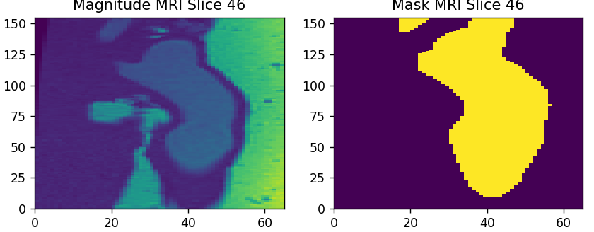
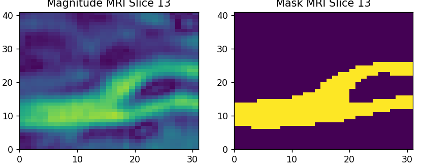
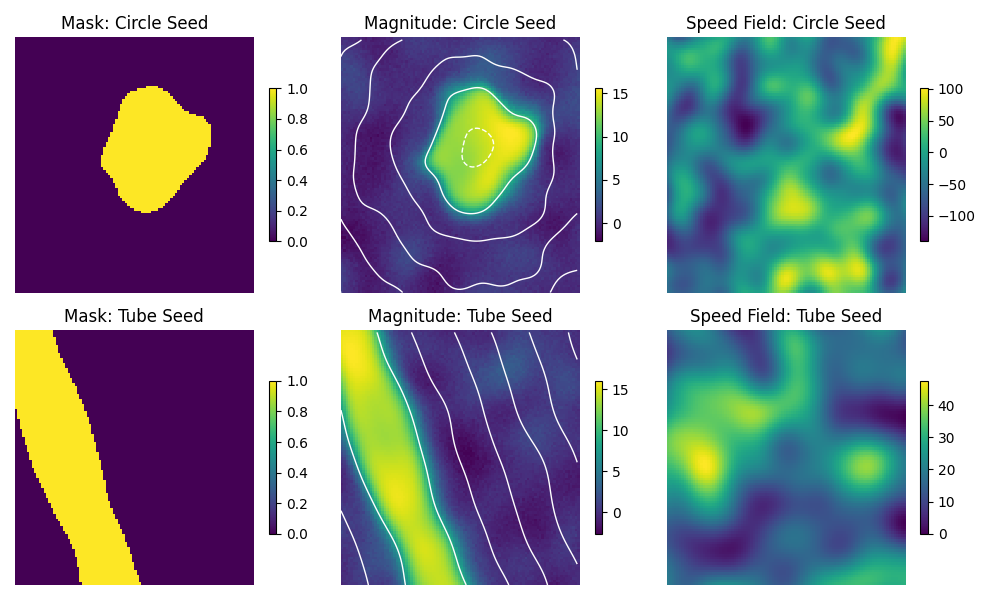

# Segmenting MRI Density/Magnitude Scans with a Fully Convolutional Network (FCN)

This sub-project explores segmenting MRI scans with various FCN architectures: the built
in FCN_ResNet_50 and FCN_ResNet_101 in PyTorch, and my own implementation of the U-Net.
The application of this particular segmentation is to use the segmentation as a high
quality first estimate for blood vessel boundaries, which will then be refined using
an iterative solver. The refined boundaries will then be used as a prior for the Inverse
Navier-Stokes Problem. See https://mpj1001.user.srcf.net/MJ_Flow_MRI.html for more details
on the full project.

## Choosing Architectures

ResNet stands for Residual Network, and is constructed off residual blocks, where skip connections allow the input to be added to the output of each block. This improves gradient stability, preventing vanishing gradients. The U-Net is an architecture that applies skip connections on a larger scale, across many convolutional layers.



*Figure 1: The U-Net architecture.*

After testing the FCN_ResNet_101, FCN_ResNet_50 and U-Net, it became very clear that the U-Net performed far better, converging faster and performing better in the validation IoU metric. FCN_ResNet support has since been removed from the repo.

The codebase is very flexible, and so new architectures can more or less be plugged into the code, as long as it outputs logits in the expected format. Directions in the future could involve improvements to the U-Net, such as the nnU-Net, or a new architecture such as a V-Net. The U-Net could then be left purely for 2D applications, and 3D applications can use more modern methods.

## Choosing Losses

I explored the use of Weighted Cross-Entropy, Dice and Focal-Tversky Losses, as well as their combinations, to train the FCN. These choices of loss functions allow us to preferentially target accurate positive (foreground) prediction, since the training data tends to sparse (majority background). The Focal-Tversky Loss was particularly prone to exploding gradients, and so was discarded. Support for the Focal-Tversky Loss remains in the code but is unrecommended.

Some preliminary fine-tuning was performed on the hyperparameters, leading to fairly good performance in training.

Next steps could involve further refinement of hyperparameters, and perhaps reintroducing the Tversky loss instead of the Dice loss, for greater flexibility and more control in the FN vs FP trade-off.

## Data

One of the largest difficulties of this project is the lack of quality pre-segmented data.
To overcome this, we use a level set method to generate synthetic data. The process is described
below:

1. Use analytical methods or pre-written packages to generate a seed SDF. In this repo, I have
written classes for tubes and circles. New seed geometries can be used by parsing the
new SDF into the utils.data_gen_utils.SDF_MRI base class initialization.
2. Generate an empty speed field and modulate it with random smooth functions.
3. Use a level-set iterative method on the speed field and seed SDFs to perturb the geometry, forming a new SDF.
4. Apply a np.where() method for the binary mask.
5. Apply an activation to the SDF with masked noise for the magnitude replica.

The masked noise consists of the product of the binary mask with random sampled coherent functions from a Gaussian Process and Gaussian White Noise.

We reserve real segmented MRI data for the validation set. It also turns out that padding the validation set with some synthetic data helps balance the training and validation set sizes, leading to better performance.

Future work would involve extracting more real data, and applying k-fold cross-validation to the synthetic data. A collection of 3D seed SDFs need to be produced, to give more variation in the training set, preventing distributional shifts between training and validation sets. Testing needs to be performed on unseen real data, to see how the model truly generalises to unseen data.



*Figure 2: This is a slice of the Aorta density scan.*



*Figure 3: This is a slice of the Carotid density scan.*



*Figure 4: This is a slice of the artificially generated density scan. The white lines overlayed on the magnitude scan are Signed Distance Field contours.*

Note: The real MRI data is not yet publicly available.

## Running the repo

Clone the repo, then run
```bash
pip install -r requirements.txt
```
and the install torch from the website https://pytorch.org/get-started/locally/.

The data folder should be formatted as:
```pgsql
data/
├── train/
|   ├── magn/
|   |   ├──train_file_name_1
|   |   ├──train_file_name_2
|   |   :
|   └── mask/
|       ├──train_file_name_1
|       ├──train_file_name_2
|       :
└── val/
    ├── magn/
    |   ├──val_file_name_1
    |   ├──val_file_name_2
    |   :
    └── mask/
        ├──val_file_name_1
        ├──val_file_name_2
        :
```