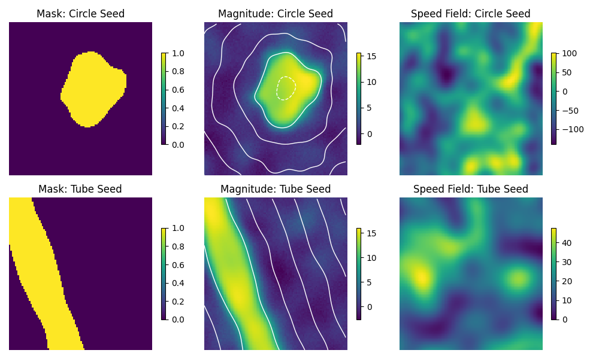

# Segmenting MRI Density/Magnitude Scans with a Fully Convolutional Network (FCN) ResNet

This sub-project explores segmenting MRI scans with the built in FCN_ResNet_101 in PyTorch.
The application of this particular segmentation is to use the segmentation as a high
quality first estimate for blood vessel boundaries, which will then be refined using
an iterative solver. The refined boundaries will then be used as a prior for the Inverse
Navier-Stokes Problem. See https://mpj1001.user.srcf.net/MJ_Flow_MRI.html for more details
on the full project.

To dive deeper into this sub-project, we use a combined Weighted Cross-Entropy and Focal-Tversky
Loss to train the FCN. These choices of loss functions allow us to preferentially target accurate
positive (foreground) prediction, since the training data tends to sparse (majority background).

One of the largest difficulties of this project is the lack of quality pre-segmented data.
To overcome this, we use a level set method to generate artificial data. The process is described
below:

1. Use analytical methods or pre-written packages to generate a seed SDF. In this repo, I have
written classes for tubes and circles. New seed geometries can be used by parsing the
new SDF into the utils.data_gen_utils.SDF_MRI base class initialization.
2. Generate a speed field and modulate it with random functions.
3. Apply the speed field to the seed SDFs to perturb the geometry, forming a new SDF.
4. Apply an activation to the SDF with noise for the magnitude replica.
5. Apply a np.where() method for the binary mask.

We reserve real segmented MRI data for the validation set.


*Figure 1: This is a slice of the Aorta density scan.*


*Figure 2: This is a slice of the Carotid density scan.*


*Figure 3: This is a slice of the artificially generated density scan. The white lines overlayed on the magnitude scan are Signed Distance Field contours.*

Note: The real MRI data is not yet publicly available.

## Running the repo

Clone the repo, then run
```python
pip install requirements.txt
```
and the install torch from the website https://pytorch.org/get-started/locally/.

The data folder should be formatted as:
```pgsql
data/
├── train/
|   ├── magn/
|   |   ├──train_file_name_1
|   |   ├──train_file_name_2
|   |   :
|   └── mask/
|       ├──train_file_name_1
|       ├──train_file_name_2
|       :
└── val/
    ├── magn/
    |   ├──val_file_name_1
    |   ├──val_file_name_2
    |   :
    └── mask/
        ├──val_file_name_1
        ├──val_file_name_2
        :
```